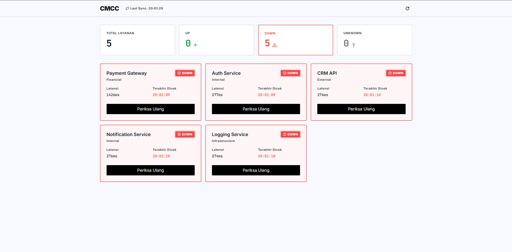
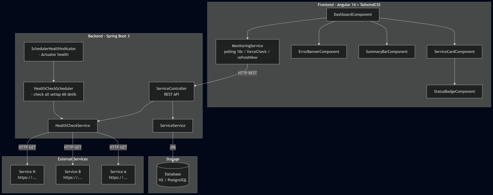

# CMCC — Centralized Monitoring Command Center

> A fullstack prototype for the **Service Reliability Initiative** — the "eyes and ears" of Support Engineers and System Administrators, designed to shift the team from a **Reactive** to a **Proactive & Resilient** culture.

---

## Table of Contents

1. [Setup Guide](#setup-guide)
2. [The "Why" — Architectural Decisions](#the-why--architectural-decisions)
3. [Challenge Log](#challenge-log)
4. [Evidence — Core Features](#evidence--core-features)

---

## Setup Guide

### Prerequisites

| Tool | Version |
|------|---------|
| Java (JDK) | 20+ |
| Maven | 3.9+ |
| Node.js | 18+ |
| npm | 9+ |
| Angular CLI | 14+ |

---

### 1. Run the Backend

The backend uses an **in-memory H2 database** by default — no database setup required.

```bash
# From the project root
./mvnw spring-boot:run
```

Or with Maven installed globally:

```bash
mvn spring-boot:run
```

The backend will start on **`http://localhost:8080`**.

On startup, the database is seeded automatically with 5 sample services via `src/main/resources/data.sql`. The first health check cycle runs immediately.

**Verify the backend is running:**

```bash
# API health
curl http://localhost:8080/actuator/health

# List all services
curl http://localhost:8080/api/services
```

---

### 2. Run the Frontend

```bash
# Navigate to the frontend directory
cd frontend

# Install dependencies (first time only)
npm install

# Start the development server
npm run start
```

The frontend will be available at **`http://localhost:4200`**.

> The frontend proxies API calls to `http://localhost:8080/api` via the environment configuration. Make sure the backend is running first.

---

### 3. Running Tests (Backend)

```bash
# From the project root
./mvnw test
```

All 21 unit tests should pass with `BUILD SUCCESS`.

---

### API Reference

| Method | Endpoint | Description |
|--------|----------|-------------|
| `GET` | `/api/services` | List all monitored services |
| `GET` | `/api/services/{id}` | Get a specific service |
| `POST` | `/api/services` | Register a new service |
| `PUT` | `/api/services/{id}` | Update service details |
| `DELETE` | `/api/services/{id}` | Remove a service |
| `POST` | `/api/services/{id}/check` | **Force re-check** a specific service |
| `POST` | `/api/services/check` | Trigger health check for all services |
| `GET` | `/actuator/health` | Self-observability: application health |
| `GET` | `/actuator/info` | Application metadata |

---

### Environment Profiles

| Profile | Database | How to Activate |
|---------|----------|-----------------|
| `local` *(default)* | H2 in-memory | Automatic |
| `prod` | PostgreSQL | Set `SPRING_PROFILES_ACTIVE=prod` and configure `DB_URL`, `DB_USERNAME`, `DB_PASSWORD` env vars |

---

## The "Why" — Architectural Decisions

### System Architecture Overview

```
┌─────────────────────────────────┐       ┌──────────────────────────────────────────┐
│  Frontend (Angular 14)          │       │  Backend (Spring Boot 3.3)               │
│                                 │       │                                          │
│  ┌─────────────────────────┐    │ HTTP  │  ┌──────────────────────────────────┐   │
│  │  MonitoringService      │◄───┼───────┼──│  ServiceController               │   │
│  │  • BehaviorSubject state│    │       │  │  • REST API endpoints             │   │
│  │  • RxJS polling (10s)   │───►┼───────┼──│  • GlobalExceptionHandler         │   │
│  └─────────────────────────┘    │       │  └──────────────────┬───────────────┘   │
│                                 │       │                      │                   │
│  ┌─────────────────────────┐    │       │  ┌───────────────────▼───────────────┐  │
│  │  Component Tree         │    │       │  │  ServiceService / HealthCheckSvc  │  │
│  │  DashboardComponent     │    │       │  └───────────────────┬───────────────┘  │
│  │  ├─ SummaryBar          │    │       │                      │                   │
│  │  ├─ ServiceCard (×n)    │    │       │  ┌───────────────────▼───────────────┐  │
│  │  │   └─ StatusBadge     │    │       │  │  HealthCheckScheduler             │  │
│  │  └─ ErrorBanner         │    │       │  │  @Scheduled(fixedRate = 60_000)   │──┼──► External Services
│  └─────────────────────────┘    │       │  └───────────────────┬───────────────┘  │
│                                 │       │                      │                   │
└─────────────────────────────────┘       │  ┌───────────────────▼───────────────┐  │
                                          │  │  H2 (dev) / PostgreSQL (prod)     │  │
                                          │  │  • services table                 │  │
                                          │  │  • health_check_logs table        │  │
                                          │  └───────────────────────────────────┘  │
                                          └──────────────────────────────────────────┘
```

---

### Backend Choices

#### Spring Boot 3.3 with H2/PostgreSQL

Spring Boot was chosen for its maturity and alignment with the organization's ecosystem. The dual-database strategy (`H2` for dev/test, `PostgreSQL` for prod via profiles) means engineers can run the project immediately — **zero infrastructure setup on day one** — while production-readiness is preserved.

#### `HealthCheckService` — Separation of Concerns

The health check logic was separated from the `ServiceService` intentionally. `HealthCheckService` is responsible solely for:
1. Performing the actual HTTP ping via `RestTemplate`
2. Measuring latency
3. Persisting the `HealthCheckLogEntity`
4. Updating the `ServiceEntity` status in-place

This separation means the check logic can be invoked from two different callers — the **scheduler** (automatic, every 60s) and the **controller** (on-demand, via the Force Re-check endpoint) — without any code duplication.

#### `HealthCheckScheduler` — Idempotency Guard

An `AtomicBoolean` flag (`running`) prevents a new health check cycle from starting if the previous one is still in progress. This is critical for slow external services (e.g., services with a 5-second delay like `httpbin.org/delay/5`) that could cause overlapping cycles and race conditions.

#### `GlobalExceptionHandler`

A centralized `@RestControllerAdvice` handles all exceptions and maps them to a consistent `ErrorResponse` DTO (`{ status, error, message, path }`). This ensures API consumers — including the frontend — always receive a structured, predictable error format.

---

### Frontend Choices

#### `BehaviorSubject` over NgRx / Signals

For a **single-view SPA** with one primary data stream, NgRx would introduce unnecessary boilerplate (actions, reducers, effects, selectors). A `BehaviorSubject<ServiceState>` inside `MonitoringService` gives us:
- **Synchronous access** to the latest state via `.getValue()`
- **Reactive streams** via `.asObservable()` for template binding
- **No memory leaks** thanks to `takeUntil(destroy$)` on the polling stream

#### RxJS Polling with `timer + switchMap`

`timer(0, 10_000)` emits immediately on start (no initial delay) and then every 10 seconds. `switchMap` ensures that if a new poll cycle starts before the previous HTTP request completes, the previous request is cancelled — preventing stale response overwrites.

#### Consecutive Failure Guard

The polling stream tracks `consecutiveFailures`. After **3 consecutive failures**, polling stops automatically, the `ErrorBanner` is shown, and a `setTimeout(retry, 30_000)` schedules an automatic recovery. This avoids hammering an already-unreachable backend.

#### `exhaustMap` philosophy for Force Re-check

The Force Re-check subscribes in `DashboardComponent` and disables the card's button during the check (`checkingMap[id] = true`). While we use a standard `subscribe` call here (with button guard), the semantic intent aligns with `exhaustMap` — subsequent clicks are ignored until the current request resolves.

---

### UI Design System

The interface is built with **Tailwind CSS 3** extended with a custom design system derived from the CMCC stitch mockup:

- **Dual-font strategy**: `Inter` for UI labels and `JetBrains Mono` for all numeric data (latency, timestamps, counters) — ensures numbers align vertically for quick scanning
- **Status-driven styling**: DOWN cards receive a 2px `#ef4444` border + light red background tint and a `pulse-animation` on the badge — making failures visually inescapable
- **Skeleton shimmer**: Replaces initial loading state with animated gray blocks that match the exact shape of the content they replace, preventing layout shift

---

## Challenge Log

### Challenge: TypeScript + `@types/node` Version Incompatibility

**What happened:** During the Angular 14 build, compilation failed immediately with dozens of errors from `node_modules/@types/node`:

```
error TS2304: Cannot find name 'Disposable'.
error TS1169: A computed property name in an interface must refer to a literal type or a 'unique symbol' type.
error TS2726: Cannot find lib definition for 'esnext.disposable'.
```

These errors originated inside `@types/node` — not our own code. The root cause was a **version mismatch**: the version of `@types/node` installed alongside Angular 14's dependencies had been updated to use TypeScript 5.2+ features (the `Symbol.dispose` / Explicit Resource Management proposal), but Angular 14 ships with TypeScript ~4.8, which doesn't know about those symbols.

**How it was resolved:**

Adding `"skipLibCheck": true` to `tsconfig.json` instructed the TypeScript compiler to skip type-checking declaration files inside `node_modules`. This is the correct and widely-accepted solution for this category of problem:
- It doesn't suppress errors in *our* code
- It only bypasses type errors inside third-party library declarations that are beyond our control

```json
// tsconfig.json
{
  "compilerOptions": {
    "skipLibCheck": true
  }
}
```

**Lesson:** When adopting a pinned framework version (Angular 14 in 2026), transitive `@types/*` dependencies can drift ahead of the framework's supported TypeScript version. Always add `skipLibCheck` preemptively for older framework projects.

---

## Evidence — Core Features

### 1. Dashboard Overview

The main dashboard showing the service grid with status summary cards, UP/DOWN/UNKNOWN indicators, and the "Periksa Ulang" (Force Re-check) button per service card.



---

### 2. System Architecture

High-level view of how the Frontend, Backend, Scheduler, and Database layers interact.




### 4. Key UI States

| State | Visual Behavior |
|-------|-----------------|
| **UP** | Green pill badge `● UP`, white card border, normal button outline |
| **DOWN** | Solid red badge `⚠ DOWN` with pulse animation, 2px red card border, red tint background, black filled button |
| **UNKNOWN** | Gray pill badge `● UNKNOWN`, white card border, latency shows `--` |
| **Loading** | Shimmer skeleton animation replaces all cards on initial load |
| **Backend Unreachable** | Full-width red error banner appears, stale data remains visible, auto-retry after 30s |

---

### 5. Spring Boot Actuator (Self-Observability)

```bash
GET http://localhost:8080/actuator/health
```

```json
{
  "status": "UP",
  "components": {
    "db": { "status": "UP", "details": { "database": "H2" } },
    "diskSpace": { "status": "UP" },
    "ping": { "status": "UP" }
  }
}
```

```bash
GET http://localhost:8080/actuator/info
```

```json
{
  "app": {
    "name": "Centralized Monitoring Command Center",
    "version": "1.0.0",
    "description": "Service Reliability Initiative - Fullstack Developer Test",
    "java-version": "20",
    "spring-boot-version": "3.3.0"
  }
}
```

---

### 6. Unit Test Coverage

```
Tests run: 21, Failures: 0, Errors: 0, Skipped: 0
BUILD SUCCESS

Tests covering:
  ✓ ServiceControllerTest   (9 tests) — HTTP layer, validation, 404 handling
  ✓ HealthCheckServiceTest  (4 tests) — UP/DOWN/Timeout detection, state update
  ✓ ServiceServiceTest      (7 tests) — CRUD logic, exception propagation
  ✓ CmccApplicationTests    (1 test)  — Spring context load
```

---

*Built as part of the Nuxatech Service Reliability Initiative — Fullstack Developer Assessment.*